# İnek-Kambur Projesi — Final Teknik Handoff

**Tarih:** 2026-09-11  
**Ana odak:** Cow Re-Identification (ReID) + longitudinal posture entegrasyonu  
**Bu belge:** projeyi devralacak ekibin tek başlangıç noktasıdır.

> Önemli: GitHub kaynak kodunu, testleri ve seçilmiş ReID checkpoint'ini içerir; ham çiftlik videoları, gerçek kimlik etiketleri, production gallery, DB dump'ları ve bazı yerel run çıktıları bilinçli olarak repoda değildir. Bunlar ayrıca devredilmelidir. Aşağıda tam checklist vardır.

---

## 1. Projenin amacı

Sabit sağımhane/koridor kameralarından geçen inekleri önce **tracklet** seviyesinde güvenilir biçimde ayırmak, ardından hayvanın gövde/benek görünümünden aynı ineği farklı video ve günlerde tekrar bulmak, son aşamada da keypoint/posture ölçümlerini doğru kimliğin longitudinal geçmişine bağlamaktır.

Bu nedenle sistem üç farklı problemi ayrı tutar:

1. **Detection / tracking:** karedeki ineği bulur ve tek geçişin karelerini aynı `tracklet_id` altında toplar.
2. **Re-ID / identity:** tracklet'ın hangi gerçek ineğe ait olduğunu görünüş embedding'i ile tahmin eder.
3. **Posture / health signal:** aynı tracklet içindeki anatomik keypoint'lerden postür sinyali üretip doğrulanmış `cow_id` geçmişine bağlar.

YOLO **kimlik modeli değildir**. Tracker ID de gerçek cow identity değildir.

---

## 2. Repository haritası

### Ana/private repo — ReID ve entegrasyon

`ColdVI/cow-reid-pipeline`

Önemli modüller:

- `cow_reid/inventory.py`: video envanteri ve metadata.
- `cow_reid/overlap.py`: duplicate/örtüşen klip grupları.
- `cow_reid/manifest.py`: ham manifest + insan düzeltmelerinden kanonik manifest.
- `cow_reid/extract.py`: YOLO tabanlı detection/tracking ve tracklet crop üretimi.
- `cow_reid/embeddings.py`, `cow_reid/metric_model.py`: embedding üretimi ve cattle-specific model.
- `cow_reid/training.py`: tarih/overlap farkında eğitim ayrımı ve fine-tune.
- `cow_reid/evaluation.py`: retrieval değerlendirmesi.
- `cow_reid/gallery.py`: confirmed identity gallery ve otomatik `KNOWN/UNKNOWN/AMBIGUOUS` tahmini.
- `cow_reid/identity.py`, `cow_reid/identity_graph.py`: insan kararları, alias/merge/cannot-link mantığı.
- `cow_reid/audit.py`: label çelişkileri ve eğitim-güvenli altküme.
- `cow_reid/debug_overlay.py`: tracklet debug video overlay.
- `cow_reid/review_app.py`: Streamlit insan inceleme arayüzü.
- `cow_reid/db.py`, `migrations/postgresql.sql`: registry/DB katmanı.
- `cow_reid/pose/*`: harici keypoint modelleri için adapter ve worker.
- `cow_reid/health/*`: frame/tracklet postür özeti ve longitudinal baseline araştırma katmanı.
- `VALIDATION_NOTES.md`: tüm doğrulama/ablasyon ve kritik veri bütünlüğü bulguları.
- `weights/README.md`: hangi checkpoint'in kullanılacağı.

### Public posture repo

`ColdVI/Cow-ArchedBack-Posture-Detection`

Bu repo arched-back / dorsal geometry ve posture score tarafının ayrı araştırma hattıdır. ReID reposu ile aynı problem değildir; kimlik katmanı burada ana görev değildir.

---

## 3. Sistem mimarisi

```mermaid
flowchart LR
    A[Raw farm videos] --> B[Inventory + timestamp/OCR]
    B --> C[SHA-256 + overlap groups]
    C --> D[Canonical manifest]
    D --> E[YOLO detection + tracking]
    E --> F[Tracklets]
    F --> G[Best torso/full-body crops]
    G --> H[ResNet50 cattle embedding 128-D]
    H --> I[Confirmed multi-prototype gallery]
    I --> J{Similarity + Top-2 margin}
    J -->|enough evidence| K[KNOWN cow_id]
    J -->|low score| L[UNKNOWN]
    J -->|close candidates| M[AMBIGUOUS]
    K --> N[Identity history]
    L --> O[Human review]
    M --> O
    F --> P[Debug overlay/video review]
    O --> Q[same / different / unsure / bad track / split]
    Q --> N
    F --> R[External keypoint adapter]
    R --> S[Frame posture features]
    S --> T[Robust tracklet posture]
    N --> T
    T --> U[Longitudinal cow history]
```



---

## 4. ReID yaklaşımının evrimi ve alınan kararlar

İlk tartışılan iki ana yaklaşım şunlardı:

- **Geçiş sırası / first-out-first-in:** sağımhaneye gidiş-dönüş sırasını identity sinyali olarak kullanmak. Yardımcı metadata olabilir fakat ineklerin sırasının değişebilmesi, eksik detection, occlusion ve farklı kamera kesitleri nedeniyle birincil identity çözümü olarak güvenilir kabul edilmedi.
- **Görünüş/benek fingerprint'i:** gövde üzerindeki siyah-beyaz desenlerin ve lokal görsel yapının identity için kullanılması. Ana ReID hattı bu yaklaşım üzerinde geliştirildi.

Final mimari **tracklet + appearance embedding + human-verified gallery** yaklaşımıdır. Tek bir frame'e veya tek bir benek crop'una güvenmek yerine bir tracklet içinden birden fazla kaliteli kare kullanılır.

---

## 5. Model ve eğitim

### Detection/tracking

Varsayılan extractor `yolo11n-seg.pt` kullanır. Bu yalnızca ineği bulup aynı geçişi tracklet olarak toplar.

Mevcut temel config (`configs/default.yaml`):

- `sample_fps: 5.0`
- `imgsz: 768`
- `confidence: 0.16`
- `nms_iou: 0.10`
- hareket yönü: `left_to_right`
- tracklet başına en fazla `12` best frame
- ROI/gate çiftlik kamerasına göre ayarlanmıştır; yeni kamera için tekrar kalibre edilmelidir.

### ReID backbone

Başlangıç modeli ImageNet değil, **OpenCows2020 üzerinde eğitilmiş ResNet-50 Softmax + Reciprocal Triplet Loss** checkpoint'idir.

Fine-tune hattı:

- backbone: ResNet-50
- projection: 128-D normalize embedding
- classification + metric learning
- `metric_loss: reciprocal`
- `metric_weight: 0.01`
- `embedding_dim: 128`
- `learning_rate: 1e-5`
- `epochs: 30`
- current selected stride layout: `torchvision`
- backbone: full fine-tune (`freeze_backbone: false`)

### Kullanılması gereken checkpoint

**Current checkpoint:**

`weights/ablation/20260907_stage_a_torchvision_finetune.pt`

Bu dosya Git LFS ile repoda tutulur. Clone sonrası `git lfs pull` gerekir.

**Kullanılmaması gereken checkpoint:**

`weights/farm_metric_resnet50.pt`

Bu tarihsel checkpoint leaky train/val split üzerinde raporlanmıştır ve production kararında kullanılmamalıdır.

---

## 6. Deneyler ve sayısal sonuçlar

### İlk saha envanteri / smoke doğrulaması

Tarihsel ilk çalışma grubunda:

- 22 fiziksel video dosyası
- SHA-256 sonrası 14 benzersiz video
- 8 birebir kopya
- 12 videoda kamera üst yazısından tarih/oturum güvenle okunabildi
- 2 IR/gece videoda timestamp güvenle okunamadı ve `unknown` bırakıldı

İki videonun ilk 60 saniyelik sanity check'inde:

- 19 ham tracker izi
- kalite/hareket/yön filtresinden geçen 10 tracklet
- her tracklet için torso/masked torso/full-body örnekleri
- 10 adet 512-D baseline embedding

ImageNet baseline'ın en yüksek cross-session aday benzerliği ~0.934 idi; ground truth olmadığı için bu eşleşmeler doğru kabul edilmedi.

### İnsan etiket audit'i — 2026-09-02 handoff

- 254 geçerli tracklet label satırı
- 101 atanmış tracklet
- 32 geçici `COW_xxxx` identity
- 80 `same` kararı
- 169 `different` kararı
- 28 doğrudan çelişkisiz identity
- 69 eğitim-güvenli tracklet
- quarantine: `COW_0009`, `COW_0019`, `COW_0025`, `COW_0028`
- 31 cannot-link çelişkisi

Hiçbir kullanıcı etiketi otomatik silinmez; çelişkili gruplar karantinaya alınır.

### Eski embedding sanity check

Eski ResNet-18 embedding'leri güvenli 69 tracklet üzerinde:

- Top-1: **%98.55**
- Top-5: **%100**
- mAP: **%98.79**

Bu değerler aynı label kümesinin kullanıldığı bir sanity check'tir; görülmemiş gün doğruluğu değildir.

### Tarihsel 30-epoch farm_metric run

Yerel eğitim run'ında kaydedilen özet:

- cows: 28
- train tracklets: 41
- val tracklets: 28
- train crops: 476
- val crops: 334
- best validation tracklet accuracy: **0.9286**

Bu sayı daha sonra tespit edilen leakage nedeniyle bağımsız unseen-day başarısı olarak kullanılmamalıdır.

### Kritik leakage bulgusu

Eski split'te 12/14 etiketli ineğin val örnekleri `vid_eef4a44f4b99` içinden geliyordu; bu kayıt train kaynağı `vid_e2b59d770f3b` ile aynı fiziksel videonun 17 saniye kaydırılmış versiyonuydu.

Kök nedenler:

- başarısız timestamp/OCR durumlarının yanlış güvenli overlap grubu gibi davranması;
- eski split'in gerçek tarih yerine `session_id` metnini lexicographic sıralaması;
- tek fiziksel geçişin train/val'e düşebilmesi.

Düzeltmeler:

- `overlap_unverified=True`
- `build-manifest` ile raw + reviewed corrections birleştirme
- gerçek tarih ve `overlap_group_id` farkında split
- doğrulanamayan tarihler val/test'e giremez
- aynı fiziksel geçiş train/val arasında bölünmez
- `tracklet_reviews.csv` eğitim/embed/gallery/audit tarafından gerçekten tüketilir
- checkpoint uyumluluğu path yerine SHA-256 + preprocessing/crop/schema contract ile kontrol edilir

### Temiz split ablasyonu — 2026-09-07

Gerçekten farklı doğrulanmış günlere sahip 29 identity bulundu; en iyi validation günü 2026-08-25 idi ve 14 identity kullanılabildi.

| Deney | Stride | Backbone | Retrieval Top-1 | mAP |
|---|---|---|---:|---:|
| A — seçildi | torchvision | full fine-tune | **%92.9 (13/14)** | **%94.6** |
| B | opencows | full fine-tune | %78.6 | %88.1 |
| C | torchvision | frozen | %85.7 | %92.9 |
| D | opencows | frozen | %78.6 | %86.3 |

Bu sonuç n=14 olduğu için yönsel kanıttır; production reliability iddiası değildir.

### Production gallery denemesi

Seçilen checkpoint ile yerel run'da:

- 75 confirmed identity
- 173 gallery prototype

`VALIDATION_NOTES.md` içinde query toplamı **758** yazarken sınıf sayıları `164 KNOWN + 16 AMBIGUOUS + 594 UNKNOWN = 774` ediyor. Bu tutarsızlık yayınlanacak/raporlanacak bir metrik kullanılmadan önce ham `identity_predictions.csv` üzerinden çözülmelidir. Buradaki handoff bilerek bu sayıları “final accuracy” olarak sunmuyor.

Mevcut eşik `0.95`, margin `0.02` konservatiftir ve henüz düzgün threshold calibration yapılmamıştır. Çok sayıda olası doğru eşleşmenin `UNKNOWN` kalması bu nedenle beklenmektedir.

---

## 7. Human-labeled ne demek? Yeni data gelince tekrar her şeyi label'lamak gerekir mi?

Hayır.

`human_labeled` / confirmed identity yalnızca bir insanın açıkça doğruladığı tracklet/identity bağlantısını ifade eder. Modelin `identity_predictions.csv` içine yazdığı otomatik tahmin **label değildir** ve otomatik olarak `labels.csv` veya gallery'ye terfi etmez.

Yeni gün geldiğinde normal production akışı:

1. sistem tracklet çıkarır;
2. embedding üretir;
3. mevcut confirmed gallery'ye karşı otomatik identity tahmini yapar;
4. yüksek güvenli `KNOWN` sonuçlar doğrudan operasyonel çıktı olabilir;
5. `UNKNOWN`, `AMBIGUOUS`, tracking hatası veya yeni hayvan şüphesi olanlar insan review kuyruğuna gider;
6. yalnız doğrulanan örnekler training/gallery için kullanılabilir.

Dolayısıyla her yeni videodaki binlerce frame veya bütün tracklet'lar tekrar elle eşleştirilmez. İnsan emeği **active review / uncertain cases / yeni identity / kalite problemi** üzerine yoğunlaşır.

Ancak modelin gerçek başarısını ölçmek için en az bir tamamen held-out gün üzerinde bağımsız human ground truth gerekir.

---

## 8. Debug ve insan inceleme akışı

Başlatma:

```bash
cow-reid review --run <run_dir>
```

Ana arayüz `cow_reid/review_app.py` içindedir.

Özellikle istenen akış uygulanmıştır:

- `COW_0012` gibi bir identity aranabilir;
- o ineğin farklı video/günlerdeki tracklet'ları gerçek kayıt zamanına göre listelenebilir;
- ilgili tracklet video içinde açılır;
- debug clip tracklet başlangıcından yaklaşık iki saniye önce başlar;
- bbox, trajectory, tracklet/identity, status ve confidence overlay gösterilir;
- kaynak video değiştirilmez, debug clip cache'lenir;
- reviewer `Aynı`, `Farklı`, `Emin değilim`, `Tracklet hatalı` veya `Geçişi böl` kararı verebilir.

Frame crop/contact sheet yalnız yardımcı kanıttır; asıl insan kontrolü video/tracklet bağlamından yapılmalıdır.

---

## 9. Yeni data için standart operating procedure

### A. Kurulum

```bash
git clone <repo-url> cow_reid_pipeline
cd cow_reid_pipeline
git lfs install
git lfs pull
python3 -m venv .venv
source .venv/bin/activate
python -m pip install --upgrade pip
python -m pip install -e ".[deep,ui,dev]"
cow-reid download-cattle-weights
python -m pytest -q
```

### B. Video inventory ve kanonik manifest

Ham video dosya adı recording time kabul edilmez. Kamera overlay/OCR ve reviewed correction birlikte kullanılmalıdır.

```bash
cow-reid build-manifest \
  --raw data/video_manifest.csv \
  --corrections exports/reviewed_manifest.csv \
  --output data/canonical_manifest.csv
```

Overlap/duplicate grup doğrulanmadan train/validation split yapılmamalıdır.

### C. Tracklet extraction

```bash
cow-reid --config configs/default.yaml extract \
  --manifest data/canonical_manifest.csv \
  --output runs/new_day
```

Yeni kamera/ROI varsa `configs/default.yaml` körlemesine kullanılmamalı; ROI, gate, yön, exposure ve sample FPS kontrol edilmelidir.

### D. Embedding

```bash
cow-reid embed \
  --run runs/new_day \
  --backend metric \
  --checkpoint weights/ablation/20260907_stage_a_torchvision_finetune.pt
```

### E. Identify

```bash
cow-reid identify \
  --run runs/new_day \
  --gallery <transferred_or_rebuilt_gallery>/cow_gallery.npz
```

### F. İnsan review

```bash
cow-reid review --run runs/new_day
```

Öncelik:

1. tracker/detection hataları;
2. `AMBIGUOUS`;
3. `UNKNOWN` ama güçlü adayları olan tracklet'lar;
4. yeni cow identity adayları;
5. periyodik düşük oranda `KNOWN` spot-check.

### G. Gallery/model güncelleme

Gallery'ye yalnız confirmed identity ekleyin. Model retraining'i her yeni video geldiğinde değil; yeterli **yeni gün + yeni confirmed identity + domain shift** biriktiğinde planlayın. Her retrain sonrası gallery aynı checkpoint/preprocessing contract ile yeniden embed edilmelidir.

---

## 10. 31 Ağustos datası konusu

Pipeline **31 Ağustos'a özel değildir**. İlk saha/etiketleme çalışmaları 31 Ağustos civarında indirilen kayıtlarla başlamıştır; sonraki handoff ve review run'ları da bu materyalin türevlerini kullanmıştır. Ancak GitHub ham video ve kanonik manifesti içermediği için sadece repoya bakarak tüm tarih kapsamını yeniden çıkarmak mümkün değildir.

Yeni ekip “mevcut model sadece 31 Ağustos'u bilir” varsayımı yapmamalıdır; doğru ifade şudur: **modelin güvenilirliği farklı gerçek günlerde doğrulanan tracklet sayısıyla sınırlıdır**. Temiz ablasyonda yalnız 29 identity'nin farklı doğrulanmış günleri vardı ve validation için 14 identity kullanılabildi.

---

## 11. Off-GitHub devredilmesi ZORUNLU artifact'lar

Kaynak repo tek başına üretim identity geçmişini yeniden kurmaya yetmez. Devralan ekibe güvenli kanalla şu artifact'ları verin:

- ham çiftlik video klasörü / arşivi;
- en güncel `data/video_manifest.csv`;
- timestamp düzeltmeleri / reviewed manifest export'ları;
- mümkünse tek kanonik `data/canonical_manifest*.csv`;
- en güncel confirmed `labels.csv`;
- `pair_reviews.csv`;
- `tracklet_reviews.csv`;
- split/merge review kuyrukları varsa onlar;
- `label_audit.csv`, `label_conflicts.csv`, `labels_training_safe.csv`;
- production gallery: `cow_gallery.npz` + metadata;
- production run'ın `identity_predictions.csv` ve `identity_summary.json`;
- gerektiğinde `runs/production_gallery_20260907/` ve `runs/review_all_20260903/` audit çıktıları;
- SQLite/PostgreSQL registry kullanıldıysa DB dump;
- harici keypoint modelinin gerçek ağırlıkları (Git LFS pointer değil);
- posture/pose için model-version + checkpoint SHA bilgileri.

Bunları public GitHub'a koymayın.

---

## 12. Keypoint / posture entegrasyonu

ReID ana odağıdır; keypoint modeli ayrı ekip/cihazda geliştirilmektedir.

Proje boyunca bildirilen saha durumu:

- ayrı keypoint tarafında yaklaşık 700 etiketli inek olduğu raporlandı;
- siyah ineklerde arka planla karışma nedeniyle keypoint kararlılığı sorunu gözlendi;
- bu nedenle siyah inek örneklerinin artırılması planlandı.

ReID reposu harici keypoint sistemiyle entegrasyon için `cow_reid.pose` adapter contract'ını içerir. `docs/KEYPOINT_INTEGRATION.md` ayrıntılı şemadır.

`LamenessDLCBackend` 15 noktalı harici DeepLabCut modelini destekler. ReID tracklet sınırları korunur; pose tarafı ikinci kez tracking çalıştırmaz. Per-frame keypoint'ler kalite kapılarından sonra robust tracklet posture özetine dönüştürülür.

Kişisel longitudinal baseline araştırma sinyali olarak vardır; klinik tanı/tedavi kararı değildir.

---

## 13. Posture repo tarafının mevcut durumu

Public posture reposunun final v1 yönü, ilk basit supervised “arched/normal” fikrinden daha ölçülebilir bir geometry/triage sistemine evrilmiştir:

- measurement kamera gate'i;
- withers / sacrum / head üç-point contract;
- 101 noktalı anchored dorsal profile;
- ana metric `anchored_sagitta_signed_norm`;
- passage median + IQR robust aggregation;
- iki gözlemcinin skorlarından data-derived absolute posture bands;
- treatment/calving kayıtlarıyla retrospektif validation;
- düşük-quality frame'leri silmek yerine reject reason/audit trail.

Repo **lameness/hastalık teşhisi yapmaz**.

`docs/IMPLEMENTATION_STATUS_V3.md` içinde kod yolları ile henüz gereken dış saha kanıtı ayrılmıştır. Kamera, gerçek 30fps measurement data, treatment/calving records ve observer calibration tamamlanmadan saha-validasyonu bitmiş sayılmaz.

Posture reposundaki kendi T1 keypoint model kararı halen `pending zero-shot run` olarak belgelenmiştir. Bunu ReID reposundaki harici 15-point DLC adapter ile karıştırmayın: bunlar iki farklı çalışma koludur.

---

## 14. Legacy / artık ana yol olmayan fikirler

Aşağıdakiler tamamen silinmemiş olabilir ama production ana hattı değildir:

- tek-frame supervised arched/normal classifier;
- frozen backbone ağırlıklı eski deneyler;
- legacy five-keypoint supervised posture;
- first-out-first-in identity'yi tek başına kullanmak;
- aynı session/veri üzerinde ölçülen yüksek retrieval sayılarını gerçek deployment accuracy gibi yorumlamak;
- `farm_metric_resnet50.pt` checkpoint'i;
- her yeni data için binlerce frame pair'i manuel label'lamak;
- otomatik model tahminlerini doğrudan human ground truth'a çevirmek.

---

## 15. Bilinen riskler ve açık problemler

1. **Az gerçek cross-day identity:** temiz deneyde yalnız 29 identity'nin birden fazla doğrulanmış günü var.
2. **Threshold calibration eksik:** `0.95/0.02` güvenli bootstrap değerleri.
3. **Open-set evaluation eksik:** daha önce hiç görülmemiş hayvanların unknown kalma başarısı ayrıca ölçülmeli.
4. **Camera/domain shift:** yeni kamera, gece/IR, siyah inek, blur/occlusion performansı düşürebilir.
5. **Production gallery GitHub'da yok:** mutlaka ayrıca teslim edilmeli veya confirmed label'larla yeniden kurulmalı.
6. **Validation Notes count mismatch:** 758 query vs category sum 774 çözülmeli.
7. **RFID API yok:** mevcut sistem RFID entegrasyonuna güvenemez; gerçek çiftlik ID mapping daha sonra eklenebilir.
8. **Hik-Connect erişimi manuel:** geçmiş kayıtlar manuel geri sarılıp kısa clip olarak indirilebiliyor; otomatik API pipeline varsaymayın.
9. **Posture klinik validasyonu tamamlanmadı:** output triage/research signal olarak kalmalı.
10. **Black-cow keypoint robustness:** harici keypoint ekibinin çözmesi gereken açık domain problemi.

---

## 16. Devralan ekip için öncelik sırası

### P0 — Artifact transfer ve reproducibility

- Off-GitHub checklist'i tamamlayın.
- `git lfs pull` ile seçili checkpoint'i doğrulayın.
- `python -m pytest -q` çalıştırın.
- canonical manifest ve overlap gruplarını audit edin.
- mevcut gallery'nin checkpoint SHA/preprocessing contract'ını doğrulayın.

### P1 — Gerçek değerlendirme

- Tamamen held-out farklı bir gün seçin.
- Ground truth'u human review ile oluşturun.
- closed-set Top-1/Top-5/mAP yanında open-set unknown rejection ölçün.
- similarity threshold ve Top-2 margin'i val üzerinde kalibre edin.
- IR/gece/siyah inek/occlusion slice'larını ayrı raporlayın.

### P2 — Yeni gün operasyonu

- yeni video ingest → canonical manifest → extract → embed → identify → review.
- yalnız uncertain/suspicious örnekleri insan review'e taşıyın.
- debug video akışını ana QA aracı olarak kullanın.

### P3 — Longitudinal posture

- keypoint modelinin sabit model-version/checkpoint hash ile inference'ını bağlayın;
- tracklet-level posture score üretin;
- confirmed cow identity ile birleştirin;
- yeterli gün birikince individual baseline/rolling median-MAD değişim analizi yapın;
- klinik alarm iddiasından önce bağımsız saha validasyonu yapın.

---

## 17. Devralma kabul kriteri

Yeni ekip aşağıdakileri bağımsız yapabiliyorsa devir başarılıdır:

- repoyu temiz makinede kurmak;
- testleri çalıştırmak;
- yeni bir video setinden tracklet üretmek;
- seçili checkpoint ile embedding üretmek;
- doğru gallery contract'ı ile identity tahmini almak;
- `cow-reid review` üzerinden bir cow ID arayıp debug klibini izlemek;
- `same/different/unsure/bad track/split` kararını kaydetmek;
- human prediction ile model prediction arasındaki farkı açıklamak;
- leaky legacy checkpoint'i kullanmamak;
- yeni bir held-out gün üzerinde doğru evaluation prosedürünü kurmak;
- keypoint/posture çıktısını `tracklet_id -> cow_id` üzerinden longitudinal geçmişe bağlamak.

---

## 18. Okuma sırası

1. **Bu dosya**
2. `README.md`
3. `VALIDATION_NOTES.md`
4. `weights/README.md`
5. `configs/default.yaml`
6. `docs/KEYPOINT_INTEGRATION.md`
7. `START_HERE_TR.md`
8. Public posture repo: `README.md`, `docs/IMPLEMENTATION_STATUS_V3.md`, `docs/KEYPOINT_MODEL_DECISION.md`, `docs/FUTURE_SYSTEM.md`

Bu noktadan sonra ana araştırma sorusu “pipeline çalışıyor mu?” değil; **farklı günlerde, farklı görüntü koşullarında ve unseen/unknown hayvanlarda kimlik güvenini nasıl kalibre edip ölçeriz?** sorusudur.
